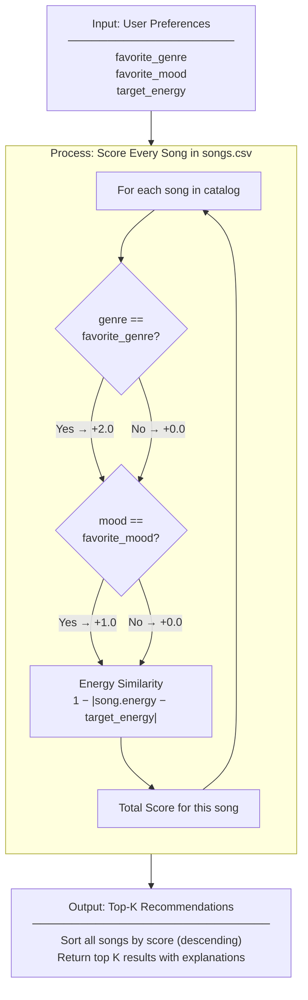

# 🎵 Music Recommender Simulation

## Project Summary

In this project you will build and explain a small music recommender system.

Your goal is to:

- Represent songs and a user "taste profile" as data
- Design a scoring rule that turns that data into recommendations
- Evaluate what your system gets right and wrong
- Reflect on how this mirrors real world AI recommenders

Replace this paragraph with your own summary of what your version does.

---

## How The System Works

Real-world recommenders like Spotify or YouTube learn your preferences from thousands of signals — skips, replays, saves, time of day — and combine them across millions of users to surface music you didn't know you needed. They blend collaborative filtering (finding listeners who behave like you) with content-based filtering (matching the audio fingerprint of songs you already love), and layer in context like whether you're working out or winding down. This simulation focuses on the content-based side of that pipeline. Rather than tracking behavior across users, it works from a single user's declared taste profile — preferred genre, mood, and energy level — and scores every song in the catalog by proximity to those preferences. A weighted formula rewards exact genre and mood matches most heavily, then grades numeric features like energy by how close a song's value is to the user's target (closer = higher score, not simply higher or lower). The top-k songs by final score become the recommendation. This prioritizes transparency and explainability: every score can be broken down into exactly which features matched and by how much, which mirrors the "Because you liked..." explanations real platforms surface to users.

**Song features used:** `genre`, `mood`, `energy`

**User profile stores:** `favorite_genre`, `favorite_mood`, `target_energy`

**Scoring:** genre match (+2.0) + mood match (+1.0) + energy proximity (1 − |song.energy − target_energy|, range 0–1.0), max score 4.0

**Ranking:** all songs scored independently, sorted descending, top-k returned

### Algorithm Recipe

1. **Load** — read `data/songs.csv` into a list of song dictionaries, casting numeric columns (`energy`, `tempo_bpm`, `valence`, `danceability`, `acousticness`) to `float`.
2. **Score each song** — for every song in the catalog, compute a score against the user profile:
   - +2.0 if `song.genre` exactly matches `user.favorite_genre`
   - +1.0 if `song.mood` exactly matches `user.favorite_mood`
   - +`(1.0 − |song.energy − user.target_energy|)` as a continuous energy-proximity bonus (always between 0.0 and 1.0)
3. **Rank** — sort all scored songs in descending order by total score.
4. **Return top-K** — slice the sorted list to the requested `k` and pair each result with its score and a plain-English explanation string.

### Potential Biases

- **Genre dominance.** The +2.0 genre bonus is double the mood bonus and double the maximum energy bonus combined. A song with a matching genre but the wrong mood and opposite energy (score ≈ 2.0) will always rank above a song with a matching mood *and* close energy but the wrong genre (score ≈ 1.9). A user who loves jazz but is in the mood to relax may receive high-energy jazz over a perfectly calm ambient track.
- **Exact-match brittleness.** Genre and mood are compared as literal strings. A song tagged `"lo-fi"` will never match a preference of `"lofi"`, and a song tagged `"relaxed"` scores zero on a `"chill"` preference even though the two moods are nearly synonymous.
- **Energy-range blindness.** The energy score rewards proximity symmetrically — a song 0.2 above the target scores the same as one 0.2 below. This treats a high-tempo overshoot the same as a low-tempo undershoot, which may not match how listeners actually experience energy mismatch.
- **Catalog size effect.** With only a small number of songs, a single dominant genre (e.g., several lofi tracks) can fill most of the top-K slots for any lofi user, leaving no room for mood or energy diversity.

---

## Data Flow



Copy Pasted Output (in lieu of screenshot for default pop/happy in phase 3 step 4)


% python -m src.main
Loaded songs: 20

Top 5 recommendations for profile {'genre': 'pop', 'mood': 'happy', 'energy': 0.8}:

--------------------------------------------------
#1  Sunrise City by Neon Echo
    Score : 3.98 / 4.00
    Why   :
            • genre match (pop, +2.0)
            • mood match (happy, +1.0)
            • energy similarity 0.98 (song=0.82, target=0.8)
--------------------------------------------------
#2  Gym Hero by Max Pulse
    Score : 2.87 / 4.00
    Why   :
            • genre match (pop, +2.0)
            • energy similarity 0.87 (song=0.93, target=0.8)
--------------------------------------------------
#3  Rooftop Lights by Indigo Parade
    Score : 1.96 / 4.00
    Why   :
            • mood match (happy, +1.0)
            • energy similarity 0.96 (song=0.76, target=0.8)
--------------------------------------------------
#4  Neon Sermon by Glitch Pastor
    Score : 1.00 / 4.00
    Why   :
            • energy similarity 1.00 (song=0.8, target=0.8)
--------------------------------------------------
#5  Bounce Theory by Def Cadence
    Score : 0.96 / 4.00
    Why   :
            • energy similarity 0.96 (song=0.84, target=0.8)
--------------------------------------------------


Phase 4 terminal output
----------------------

% python -m src.main
Loaded songs: 20

======================================================
  Profile : High-Energy Pop
  Prefs   : {'genre': 'pop', 'mood': 'happy', 'energy': 0.9}
======================================================
  #1  Sunrise City by Neon Echo
      Score : 3.92 / 4.00
              • genre match (pop, +2.0)
              • mood match (happy, +1.0)
              • energy similarity 0.92 (song=0.82, target=0.9)
  ----------------------------------------------------
  #2  Gym Hero by Max Pulse
      Score : 2.97 / 4.00
              • genre match (pop, +2.0)
              • energy similarity 0.97 (song=0.93, target=0.9)
  ----------------------------------------------------
  #3  Rooftop Lights by Indigo Parade
      Score : 1.86 / 4.00
              • mood match (happy, +1.0)
              • energy similarity 0.86 (song=0.76, target=0.9)
  ----------------------------------------------------
  #4  Storm Runner by Voltline
      Score : 0.99 / 4.00
              • energy similarity 0.99 (song=0.91, target=0.9)
  ----------------------------------------------------
  #5  Carnival Lights by Los Fuegos
      Score : 0.97 / 4.00
              • energy similarity 0.97 (song=0.87, target=0.9)
  ----------------------------------------------------

======================================================
  Profile : Chill Lofi
  Prefs   : {'genre': 'lofi', 'mood': 'chill', 'energy': 0.35}
======================================================
  #1  Library Rain by Paper Lanterns
      Score : 4.00 / 4.00
              • genre match (lofi, +2.0)
              • mood match (chill, +1.0)
              • energy similarity 1.00 (song=0.35, target=0.35)
  ----------------------------------------------------
  #2  Midnight Coding by LoRoom
      Score : 3.93 / 4.00
              • genre match (lofi, +2.0)
              • mood match (chill, +1.0)
              • energy similarity 0.93 (song=0.42, target=0.35)
  ----------------------------------------------------
  #3  Focus Flow by LoRoom
      Score : 2.95 / 4.00
              • genre match (lofi, +2.0)
              • energy similarity 0.95 (song=0.4, target=0.35)
  ----------------------------------------------------
  #4  Spacewalk Thoughts by Orbit Bloom
      Score : 1.93 / 4.00
              • mood match (chill, +1.0)
              • energy similarity 0.93 (song=0.28, target=0.35)
  ----------------------------------------------------
  #5  Coffee Shop Stories by Slow Stereo
      Score : 0.98 / 4.00
              • energy similarity 0.98 (song=0.37, target=0.35)
  ----------------------------------------------------

======================================================
  Profile : Deep Intense Rock
  Prefs   : {'genre': 'rock', 'mood': 'intense', 'energy': 0.95}
======================================================
  #1  Storm Runner by Voltline
      Score : 3.96 / 4.00
              • genre match (rock, +2.0)
              • mood match (intense, +1.0)
              • energy similarity 0.96 (song=0.91, target=0.95)
  ----------------------------------------------------
  #2  Gym Hero by Max Pulse
      Score : 1.98 / 4.00
              • mood match (intense, +1.0)
              • energy similarity 0.98 (song=0.93, target=0.95)
  ----------------------------------------------------
  #3  Hardwired by Iron Circuit
      Score : 0.98 / 4.00
              • energy similarity 0.98 (song=0.97, target=0.95)
  ----------------------------------------------------
  #4  Carnival Lights by Los Fuegos
      Score : 0.92 / 4.00
              • energy similarity 0.92 (song=0.87, target=0.95)
  ----------------------------------------------------
  #5  Bounce Theory by Def Cadence
      Score : 0.89 / 4.00
              • energy similarity 0.89 (song=0.84, target=0.95)
  ----------------------------------------------------

======================================================
  Profile : Conflicting: High-Energy but Chill Mood
  Prefs   : {'genre': 'ambient', 'mood': 'chill', 'energy': 0.95}
======================================================
  #1  Spacewalk Thoughts by Orbit Bloom
      Score : 3.33 / 4.00
              • genre match (ambient, +2.0)
              • mood match (chill, +1.0)
              • energy similarity 0.33 (song=0.28, target=0.95)
  ----------------------------------------------------
  #2  Midnight Coding by LoRoom
      Score : 1.47 / 4.00
              • mood match (chill, +1.0)
              • energy similarity 0.47 (song=0.42, target=0.95)
  ----------------------------------------------------
  #3  Library Rain by Paper Lanterns
      Score : 1.40 / 4.00
              • mood match (chill, +1.0)
              • energy similarity 0.40 (song=0.35, target=0.95)
  ----------------------------------------------------
  #4  Gym Hero by Max Pulse
      Score : 0.98 / 4.00
              • energy similarity 0.98 (song=0.93, target=0.95)
  ----------------------------------------------------
  #5  Hardwired by Iron Circuit
      Score : 0.98 / 4.00
              • energy similarity 0.98 (song=0.97, target=0.95)
  ----------------------------------------------------

======================================================
  Profile : Ghost Genre (country)
  Prefs   : {'genre': 'country', 'mood': 'happy', 'energy': 0.7}
======================================================
  #1  Rooftop Lights by Indigo Parade
      Score : 1.94 / 4.00
              • mood match (happy, +1.0)
              • energy similarity 0.94 (song=0.76, target=0.7)
  ----------------------------------------------------
  #2  Sunrise City by Neon Echo
      Score : 1.88 / 4.00
              • mood match (happy, +1.0)
              • energy similarity 0.88 (song=0.82, target=0.7)
  ----------------------------------------------------
  #3  Night Drive Loop by Neon Echo
      Score : 0.95 / 4.00
              • energy similarity 0.95 (song=0.75, target=0.7)
  ----------------------------------------------------
  #4  Soul Kitchen by Velvet Browne
      Score : 0.92 / 4.00
              • energy similarity 0.92 (song=0.62, target=0.7)
  ----------------------------------------------------
  #5  Empty Hallways by Grayscale Theory
      Score : 0.90 / 4.00
              • energy similarity 0.90 (song=0.6, target=0.7)
  ----------------------------------------------------

======================================================
  Profile : Floor Energy
  Prefs   : {'genre': 'lofi', 'mood': 'focused', 'energy': 0.0}
======================================================
  #1  Focus Flow by LoRoom
      Score : 3.60 / 4.00
              • genre match (lofi, +2.0)
              • mood match (focused, +1.0)
              • energy similarity 0.60 (song=0.4, target=0.0)
  ----------------------------------------------------
  #2  Library Rain by Paper Lanterns
      Score : 2.65 / 4.00
              • genre match (lofi, +2.0)
              • energy similarity 0.65 (song=0.35, target=0.0)
  ----------------------------------------------------
  #3  Midnight Coding by LoRoom
      Score : 2.58 / 4.00
              • genre match (lofi, +2.0)
              • energy similarity 0.58 (song=0.42, target=0.0)
  ----------------------------------------------------
  #4  Glacier Blue by Fjord Ensemble
      Score : 0.80 / 4.00
              • energy similarity 0.80 (song=0.2, target=0.0)
  ----------------------------------------------------
  #5  Bamboo Wind by Koto Dreams
      Score : 0.75 / 4.00
              • energy similarity 0.75 (song=0.25, target=0.0)
  ----------------------------------------------------


---

## Getting Started

### Setup

1. Create a virtual environment (optional but recommended):

   ```bash
   python -m venv .venv
   source .venv/bin/activate      # Mac or Linux
   .venv\Scripts\activate         # Windows

2. Install dependencies

```bash
pip install -r requirements.txt
```

3. Run the app:

```bash
python -m src.main
```

### Running Tests

Run the starter tests with:

```bash
pytest
```

You can add more tests in `tests/test_recommender.py`.

---

## Experiments You Tried

Use this section to document the experiments you ran. For example:

- What happened when you changed the weight on genre from 2.0 to 0.5
- What happened when you added tempo or valence to the score
- How did your system behave for different types of users

---

## Limitations and Risks

Summarize some limitations of your recommender.

Examples:

- It only works on a tiny catalog
- It does not understand lyrics or language
- It might over favor one genre or mood

You will go deeper on this in your model card.

---

## Reflection

Read and complete `model_card.md`:

[**Model Card**](model_card.md)

Write 1 to 2 paragraphs here about what you learned:

- about how recommenders turn data into predictions
- about where bias or unfairness could show up in systems like this


---

## 7. `model_card_template.md`

Combines reflection and model card framing from the Module 3 guidance. :contentReference[oaicite:2]{index=2}  

```markdown
# 🎧 Model Card - Music Recommender Simulation

## 1. Model Name

Give your recommender a name, for example:

> VibeFinder 1.0

---

## 2. Intended Use

- What is this system trying to do
- Who is it for

Example:

> This model suggests 3 to 5 songs from a small catalog based on a user's preferred genre, mood, and energy level. It is for classroom exploration only, not for real users.

---

## 3. How It Works (Short Explanation)

Describe your scoring logic in plain language.

- What features of each song does it consider
- What information about the user does it use
- How does it turn those into a number

Try to avoid code in this section, treat it like an explanation to a non programmer.

---

## 4. Data

Describe your dataset.

- How many songs are in `data/songs.csv`
- Did you add or remove any songs
- What kinds of genres or moods are represented
- Whose taste does this data mostly reflect

---

## 5. Strengths

Where does your recommender work well

You can think about:
- Situations where the top results "felt right"
- Particular user profiles it served well
- Simplicity or transparency benefits

---

## 6. Limitations and Bias

Where does your recommender struggle

Some prompts:
- Does it ignore some genres or moods
- Does it treat all users as if they have the same taste shape
- Is it biased toward high energy or one genre by default
- How could this be unfair if used in a real product

---

## 7. Evaluation

How did you check your system

Examples:
- You tried multiple user profiles and wrote down whether the results matched your expectations
- You compared your simulation to what a real app like Spotify or YouTube tends to recommend
- You wrote tests for your scoring logic

You do not need a numeric metric, but if you used one, explain what it measures.

---

## 8. Future Work

If you had more time, how would you improve this recommender

Examples:

- Add support for multiple users and "group vibe" recommendations
- Balance diversity of songs instead of always picking the closest match
- Use more features, like tempo ranges or lyric themes

---

## 9. Personal Reflection

A few sentences about what you learned:

- What surprised you about how your system behaved
- How did building this change how you think about real music recommenders
- Where do you think human judgment still matters, even if the model seems "smart"

